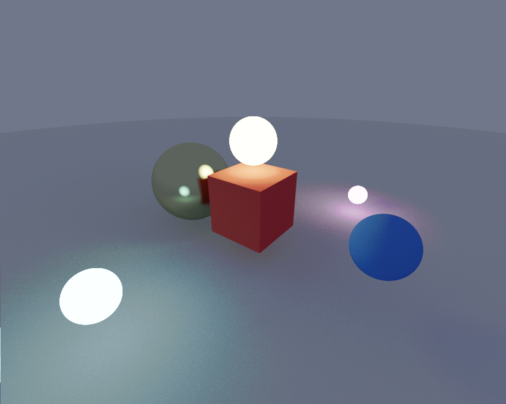

# WebGPU Sketch
Working on a raytracer using WebGPU.

Based on code from these sources:
* https://surma.dev/things/webgpu/ 
* https://austin-eng.com/webgpu-samples/samples/imageBlur
* https://blog.demofox.org/2020/06/06/casual-shadertoy-path-tracing-2-image-improvement-and-glossy-reflections/
* https://www.reedbeta.com/blog/hash-functions-for-gpu-rendering/

## How to build and run

* Install with `yarn`
* Build with `yarn build`
* Run an interactive Snowpack server with `yarn start`. Snowpack should open a tab at `http://localhost:8080` that runs the app.

Controls are WASD to rotate, QZ to zoom in and out.